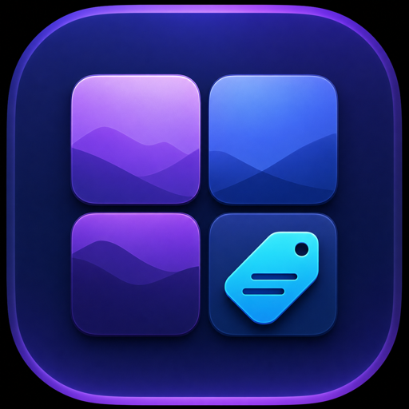

<div align="center">

  

  <h1>Spaces Renamer</h1>

  <p><b>Give every macOS Space a name that sticks.</b></p>

  <p>
    Name Spaces from a small native menu-bar app and see those names in Mission Control.<br />
    Manual profiles, application-based labels, and yabai labels—without giving up your workflow.
  </p>

  <p>
    <a href="https://github.com/wiggly-sheets/spaces-renamer/actions/workflows/release.yml"></a>
    <a href="https://github.com/wiggly-sheets/spaces-renamer/releases"></a>
    <a href="LICENSE"></a>
    
  </p>

  <p>
    <a href="https://github.com/wiggly-sheets/spaces-renamer/releases/latest"><b>Download</b></a>
    &nbsp;·&nbsp;
    <a href="#installation">Install guide</a>
    &nbsp;·&nbsp;
    <a href="#using-spaces-renamer">Usage</a>
    &nbsp;·&nbsp;
    <a href="#building-from-source">Build from source</a>
    &nbsp;·&nbsp;
    <a href="#security-and-compatibility">Security</a>
  </p>

</div>

---

macOS does not give Spaces persistent names. Spaces Renamer does: choose names yourself, organize them into profiles such as **Work** and **Home**, or generate labels from the apps in each Space or from yabai.

It is a native macOS menu-bar app paired with a small bundle injected into the process that draws the Spaces bar. Profile and name changes are published immediately—there is no need to restart the app or the Spaces-bar host.

> [!WARNING]
> Showing names inside Mission Control requires injecting a bundle into a system process. This currently needs Apple silicon, the `-arm64e_preview_abi` boot argument, and reduced macOS security protections. Read [Security and compatibility](#security-and-compatibility) before enabling it.

## Features

- Native SwiftUI menu-bar popover and settings window
- Persistent manual names, keyed by each macOS Space UUID
- Built-in **Work** and **Home** profiles, plus your own profiles
- Switch profiles instantly from the menu bar
- Three naming modes: **Manual Profiles**, **Apps in Space**, and **yabai Space Labels**
- Apps mode can show up to three real, user-facing apps in reading order; optionally retain duplicates such as `Safari · Safari`
- Menu-bar display: icon, current Space name, or number and name
- Configurable global hotkey (Control–Option–R by default)
- Launch at login, a bundled `sr` command-line tool, deeplinks, and a live TOML config file
- Two injection backends: **DYLD** (per-user, no root) and **MIP** (system-wide, survives reboot)
- Universal app (`arm64` + `x86_64`) and Dock bundle (`arm64e` + `x86_64`)

Generated naming modes require [yabai](https://github.com/koekeishiya/yabai). Apps mode deliberately filters out background, minimized, hidden, zero-sized, and placeholder windows so labels reflect the apps you are actually using.

---

## Installation

### Download the app

macOS 14 or later. Apple silicon is required for Mission Control renaming, but the app itself runs on `arm64` and `x86_64`.

1. Download `SpacesRenamer-v{VERSION}.dmg` from [GitHub Releases](https://github.com/wiggly-sheets/spaces-renamer/releases/latest).
2. Open the DMG and drag **SpacesRenamer.app** to **Applications**.
3. Open the app. If macOS blocks the unsigned build, right-click it in Finder, choose **Open**, then confirm **Open**. Alternatively:

   ```bash
   xattr -dr com.apple.quarantine /Applications/SpacesRenamer.app
   ```

Or install the Homebrew cask (signed releases only; prereleases skip the cask):

```bash
brew install --cask wiggly-sheets/spacesrenamer/spacesrenamer
```

### Enable Mission Control names

On first launch the app asks for your consent before it attaches to the Spaces-bar process. The grant persists: with **Keep Dock Renaming Active** on, the app re-injects automatically at login and whenever the host process (re)launches, so a Dock or WindowManager restart does not turn renaming off. You can still activate or deactivate manually any time.

Injecting needs three prerequisites, each checked in **Settings → Diagnostics**:

1. **Apple silicon.**
2. **System Integrity Protection (SIP)** disabled, or reduced to the documented narrower configuration (filesystem, debugging, and NVRAM protections off). This is the one step the app cannot automate—SIP can only be disabled from Recovery. The Diagnostics pane copies the command (`csrutil disable`) for you; the Recovery reboot is manual.
3. **The `-arm64e_preview_abi` boot argument.** In **Settings → Diagnostics**, the **Enable & restart…** button adds the flag for you with an administrator prompt (preserving any existing boot-args) and offers to reboot. The flag takes effect on the next reboot.

Once the boot argument is active, choose an injection method in **Settings → Injection** and activate under **Injection method**, or press **Inject Now** in the menu-bar popover. The app elevates only where a method needs it: DYLD activation is unprivileged; MIP, like the boot-argument write, asks for a password / Touch ID through the standard macOS admin dialog.

Never assume a successful activation means the hook is applied. The bundle self-reports through a preference-domain marker; **Settings → Diagnostics** shows **Plugin version** and **Plugin active in host** green only when that report is current in the running host.

### Injection methods: DYLD and MIP

Spaces Renamer loads `spaces-renamer.dylib` into the process that draws the Spaces bar—`WindowManager` on macOS 27 and later, `Dock` on earlier releases. Both backends are driven by the same embedded `injector.sh`; pick one in **Settings → Injection → Injection method**.

| | **DYLD** (default) | **MIP** |
| --- | --- | --- |
| Root needed | No | Yes (one-time install + admin prompt) |
| Mechanism | Per-user LaunchAgent sets `DYLD_INSERT_LIBRARIES` and restarts the host | A filtered bundle in [MIP](https://github.com/LIJI32/MIP)'s system `Bundles/` directory |
| Scope | Loaded into every app you launch; no-ops in anything but the host | Injected only into `WindowManager`/`Dock` |
| Persistence | Reloads at each login (the agent) | Survives reboot with no login agent |
| Removal | **Inject Now → Deactivate** or `injector.sh dyld off` | **Deactivate** or `injector.sh mip off` (root) |

**DYLD (default, no admin after consent).** A per-user LaunchAgent publishes `DYLD_INSERT_LIBRARIES` and restarts the host, so the plugin reloads at every login and nothing is written outside your home folder. Because the variable is global, the library is loaded into every app you launch while it is on—the plugin's constructor returns immediately in any process that isn't `WindowManager` or `Dock`, so it does nothing there. It is also the injector the app reacts to: if renaming stops applying after a host restart (the agent only re-publishes the variable at login), press **Inject Now** or switch to MIP.

**MIP (targeted, survives reboot).** [MIP](https://github.com/LIJI32/MIP) is a system-wide injection platform that loads a bundle only into the executables named in its `Info.plist`—here `WindowManager` and `Dock`. It needs a one-time privileged install and an administrator prompt to place the bundle, but no login agent.

> **Heads up:** MIP is upstream-tested only up to macOS Sonoma. It works on macOS 26/27 with the arm64e preview ABI but is unsupported by its author, and a bad injector can require a [Recovery-boot fix](https://github.com/LIJI32/MIP#disclaimer). macOS updates can also silently drop boot arguments; if the host dies with `Killed: 9` after an OS update, re-check `nvram boot-args` and re-add `-arm64e_preview_abi`.

To use MIP, install it once per its README, then drop in our bundle:

```bash
# One-time MIP install (build from source; there are no prebuilt binaries)
xcode-select --install
brew install binutils   # keg-only — put $(brew --prefix binutils)/bin on your PATH so gobjcopy is found
export PATH="$(brew --prefix binutils)/bin:$PATH"
# Make or reuse a codesigning identity (a self-signed one is fine; MIP warns
# that an improperly signed install will make your system unstable)
make SIGN_IDENTITY="<identity common name>"
sudo make install
```

`sudo make install` places MIP under `/Library/Apple/System/Library/Frameworks/mip`, installs `/usr/local/bin/inject`, registers two root LaunchDaemons (`/Library/LaunchDaemons/local.injectd.plist` and `local.lsdinjector.plist`), sets a global `DisableLibraryValidation=true`, and appends `tss_should_crash=0 amfi_get_out_of_my_way=1` to your boot-args. A reboot is required afterwards. Then activate our bundle in **Settings → Injection → Injection method → MIP** (or `injector.sh mip on <SpacesRenamer.mip.bundle>` as root). The Diagnostics pane greys MIP activation out until MIP is installed.

> MIP's `make uninstall` is incomplete: it removes the MIP frameworks, the `lsdinjector` LaunchDaemon and the library-validation default, but leaves `/usr/local/bin/inject`, the `injectd` LaunchDaemon, and the boot-args it added. If MIP ever prevents Terminal from opening, boot to Recovery and `rm /Library/LaunchDaemons/local.lsdinjector.plist`, which disables MIP.

### Uninstall

1. **Deactivate** — in the popover or **Settings → Injection**, or from a checkout `injection/injector.sh dyld off` (DYLD) / `injector.sh mip off` (MIP). This removes the LaunchAgent or MIP bundle and restarts the host clean.
2. Turn off **Launch at login**, then quit the app.
3. Drag **SpacesRenamer.app** to the Trash, or `brew uninstall --cask spacesrenamer`.
4. Optionally clear the published names:

   ```bash
   defaults delete com.apple.dock SpacesRenamerNames
   defaults delete com.apple.dock SpacesRenamerMonitors
   defaults delete com.apple.WindowManager SpacesRenamerPlugin   # or com.apple.dock on macOS 26 and earlier
   ```

5. If a name still shows, restart the host: `killall WindowManager` (macOS 27+) or `killall Dock`.

---

## Using Spaces Renamer

### Menu bar

Click the square-grid status item to open the popover: one row per display with the current Space highlighted, a **Profile** menu, a gear button for Settings, and a footer with the naming-mode menu, injection status plus **Inject Now**/**Deactivate**, the **Keep Dock Renaming Active** toggle, and **Quit**.

Choose icon, Space name, or number-and-name display in **Settings → General**. The menu-bar text updates live when the active Space, profile, or generated names change. Press **Control–Option–R** from anywhere to open Settings (change it in **Settings → Hotkey**) — the popover itself cannot be opened programmatically. Press Return to commit the active name; closing the popover also saves edited manual names.

### Profiles and naming modes

Manual names belong to profiles, so one set of Spaces can be **Work** during the week and **Home** after hours. Names are stored against stable Space UUIDs and the active profile is republished to the host immediately when it changes.

| Mode | What appears in Mission Control | Requires yabai |
| --- | --- | --- |
| Manual Profiles | The names you assign to each Space | No |
| Apps in Space | Up to three app names, e.g. `Xcode · Safari` | Yes |
| yabai Space Labels | Labels defined in yabai | Yes |

### Command line (`sr`)

Spaces Renamer installs a convenient `sr` symlink at `~/.local/bin/sr` on launch.

```bash
sr status                  # Profile, naming mode, and spaces
sr renamer                 # Open Settings (the popover cannot be opened programmatically)
sr settings                # Open Settings
sr profile list            # List profiles
sr profile switch <uuid>   # Activate a profile
sr naming manual           # Use manual names
sr naming applications     # Name Spaces from apps (needs yabai)
sr naming yabaiLabels      # Use yabai Space labels
sr space <uuid> name <n>   # Set a manual name
man sr                     # Read the full manual
```

If the command is unavailable, make sure `~/.local/bin` is in your `PATH`, or create it yourself:

```bash
ln -sf /Applications/SpacesRenamer.app/Contents/Resources/sr ~/.local/bin/sr
```

### Deeplinks and config file

Use `spacesrenamer://` URLs from Shortcuts, browsers, or another launcher:

| URL | Action |
| --- | --- |
| `spacesrenamer://settings` | Open Settings |
| `spacesrenamer://renamer` | Open Settings (the popover cannot be opened programmatically) |
| `spacesrenamer://profile/switch/<uuid>` | Switch profile |
| `spacesrenamer://naming/manual` | Use manual names |
| `spacesrenamer://naming/applications` | Use Apps in Space mode |
| `spacesrenamer://naming/yabaiLabels` | Use yabai labels mode |
| `spacesrenamer://space/<uuid>/name?name=<encoded>` | Set a Space name |
| `spacesrenamer://status` | Write status JSON to the legacy `/tmp/spaces-renamer-status-$UID.json` path; `sr` uses a private per-request reply file |

For external profile management, Spaces Renamer watches `~/.config/spacesrenamer/config.toml` and applies changes live:

```toml
[settings]
# naming_mode = "manual" # manual, applications, or yabaiLabels
# menu_bar_display = "icon" # icon, spaceName, or spaceNumberAndName
# show_duplicate_apps = false

[profiles.Work]
# uuid = "00000000-0000-0000-0000-000000000000"
# "space-uuid" = "Code"
```

---

## Troubleshooting

- **Nothing renames after Activate.** Re-run **Settings → Diagnostics**. "Plugin active in host" stays red if SIP is on, the arm64e boot argument isn't set, or the host hasn't restarted since the injector ran. Open Mission Control once so the plugin's first hook fires.
- **"Plugin version" is green but "Plugin active in host" is red.** The plugin loaded into a host that has since been replaced (stale marker). Restart the host (`killall WindowManager` / `killall Dock`) or press **Inject Now**.
- **WindowManager crash-loops.** Pull it out of the launch loop, then relaunch it:

  ```bash
  launchctl bootout gui/$(id -u)/com.apple.WindowManager.agent
  launchctl bootstrap gui/$(id -u) /System/Library/LaunchAgents/com.apple.WindowManager.plist
  ```

  If the loop started right after activation, `injection/injector.sh dyld off` is the documented recovery—it removes the environment variable and restarts the host clean.
- **Host dies with `Killed: 9` shortly after launch.** On an arm64e preview ABI the kernel rejects an improperly signed/loaded library. On MIP this is usually the `-arm64e_preview_abi` boot argument having gone missing after a macOS update—re-add it (`sudo nvram boot-args=<existing> -arm64e_preview_abi`) and reboot. On DYLD, re-run `make package-injection` so the payload is ad-hoc signed, then activate.
- **Why does "Plugin active" stay red even though activation succeeded?** The handshake is a self-report, not an injector exit code. The bundle writes `Version`/`Build`/`HostPID`/`HostBundleID`/`LoadedAt`/`FirstHookAt` into its host's own preference domain; the first hook firing is what sets `FirstHookAt`. Inspect it with `defaults read com.apple.WindowManager SpacesRenamerPlugin` (or `defaults read com.apple.dock SpacesRenamerPlugin` on macOS 26 and earlier).
- **Names stop applying after a host restart.** DYLD's per-user agent only re-publishes the environment variable at login, so a host relaunched outside the agent (for example after a crash) comes back without the hook until the next login. Press **Inject Now**, or use MIP, which is not tied to the login agent.
- **MIP activation is greyed out.** MIP isn't installed; follow the [MIP install steps](#injection-methods-dyld-and-mip) and reopen the app.
- **Gatekeeper won't open the app.** It's an unsigned build; run `xattr -dr com.apple.quarantine /Applications/SpacesRenamer.app`.

---

## Building from source

Requirements: macOS 14+, Xcode 15+, and [`scdoc`](https://git.sr.ht/~emersion/scdoc).

```bash
brew install scdoc
git clone https://github.com/wiggly-sheets/spaces-renamer.git
cd spaces-renamer
make universal
```

`make universal` builds the app and Dock bundle, packages the current arm64e injection payload, and verifies all architecture slices.

| Artifact | Architectures |
| --- | --- |
| `SpacesRenamer.app` | `arm64`, `x86_64` |
| `spaces-renamer.dylib` | `arm64e`, `x86_64` |
| `injection/lib/spaces-renamer.dylib` | `arm64e` |

Useful targets:

```bash
make app                # Build the menu-bar app
make plugin             # Build the Dock bundle
make package-injection  # Refresh the arm64e payload
make bundle             # Assemble the MIP bundle
make inject             # Activate DYLD manually (injector.sh dyld on)
make verify             # Verify all architecture slices and embedded payload
make dmg VERSION=1.0.0  # Create a distributable DMG
make test               # Run repository contract tests
```

## Security and compatibility

The injected bundle uses private macOS APIs inside the Spaces-bar host. Mission Control's private layer hierarchy can change between macOS releases, so the onboard hook is deliberately defensive: it validates the layer tree before touching anything and falls back to normal host behavior rather than crashing.

Injecting code into a system process requires reduced macOS security protections, which this project does not hide:

- **Apple silicon** (the host processes are arm64e binaries).
- **SIP disabled** or reduced so filesystem, debugging, and NVRAM protections are off. Only you can change this, from Recovery.
- **The `-arm64e_preview_abi` boot argument**, which the app can add for you via an administrator prompt. It takes effect on the next reboot.

To inject manually from a checkout:

```bash
./injection/injector.sh dyld on injection/lib/spaces-renamer.dylib   # no root
./injection/injector.sh status                                        # current host, prerequisites, active backend
./injection/injector.sh dyld off                                      # deactivate
```

The MIP path and the boot-argument write ask for administrator authorization through the standard macOS dialog. The repository never changes SIP, reboots your Mac, installs a privileged helper, or runs the injector without your approval. Building the project is safe: it does not inject, alter boot arguments, change SIP, or restart the host.

For performance investigation, the bundle emits `os_signpost` data under subsystem `com.wiggly-sheets.spaces-renamer`, category `DockHook`. Attach Instruments to the host and use Points of Interest or Time Profiler while opening Mission Control.

## Data and privacy

Preferences stay on your Mac:

```text
~/Library/Application Support/SpacesRenamer/preferences.json
```

The app and the injected bundle communicate through live preference domains, not files (the host runs sandboxed and can read `com.apple.dock` but not your home folder):

| Domain | Key | Written by | Content |
| --- | --- | --- | --- |
| `com.apple.dock` | `SpacesRenamerNames` | app | `{ space uuid : name }` |
| `com.apple.dock` | `SpacesRenamerMonitors` | app | the `CGSCopyManagedDisplaySpaces` array |
| `com.apple.WindowManager` or `com.apple.dock` | `SpacesRenamerPlugin` | injected bundle | `Version`, `Build`, `HostPID`, `HostBundleID`, `LoadedAt`, `FirstHookAt` |

Inspect any of them with e.g. `defaults read com.apple.dock SpacesRenamerNames`. The app does not need to upload your Space names or window labels to provide its core functionality.

## License

Spaces Renamer is available under the [MIT License](LICENSE). It is a modern rewrite of the original [Spaces Renamer](https://github.com/dado3212/spaces-renamer) by Alex Beals, updated for macOS 14+ with DYLD/MIP injection on Apple silicon.